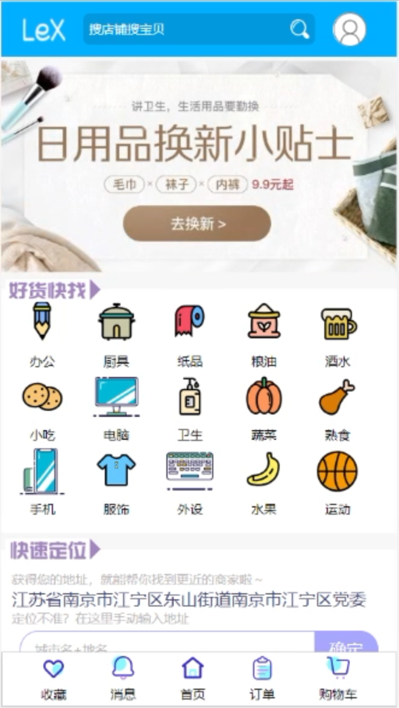
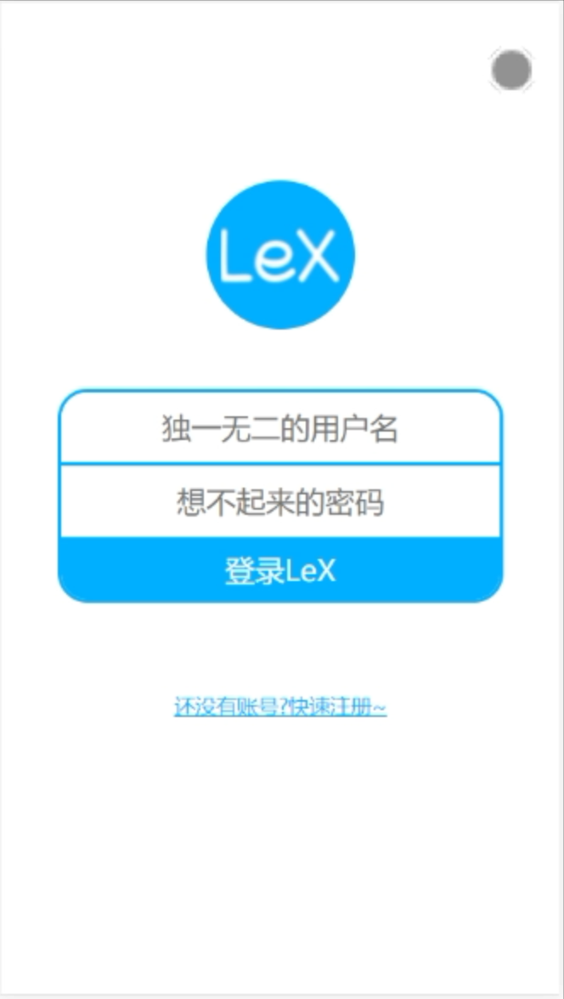
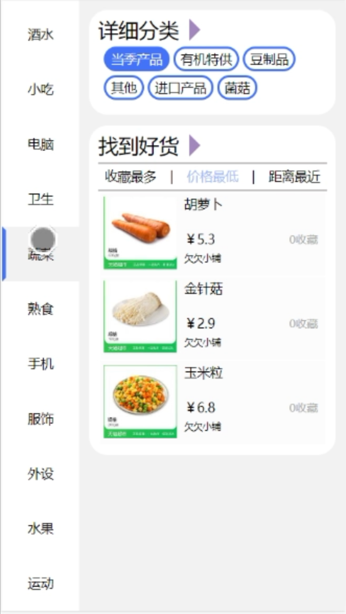
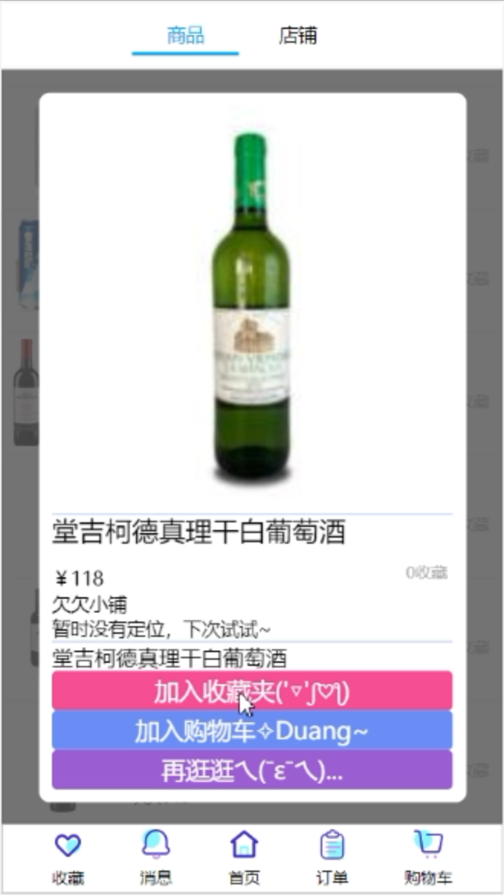
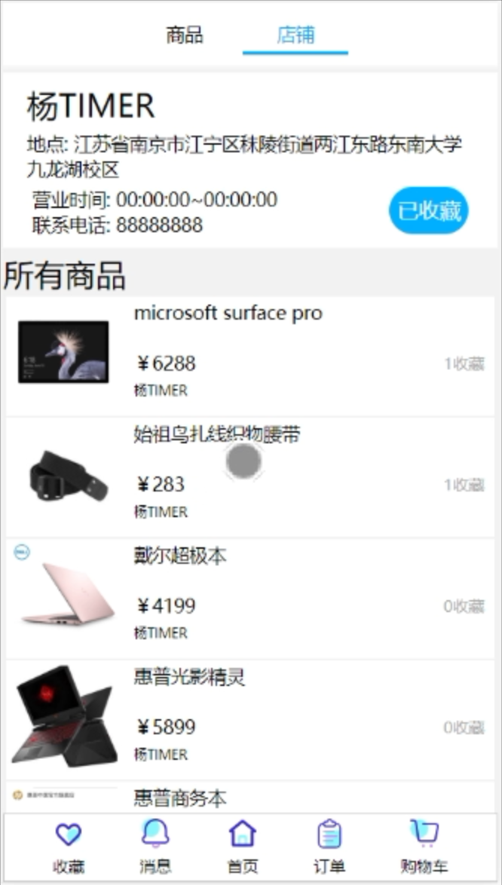
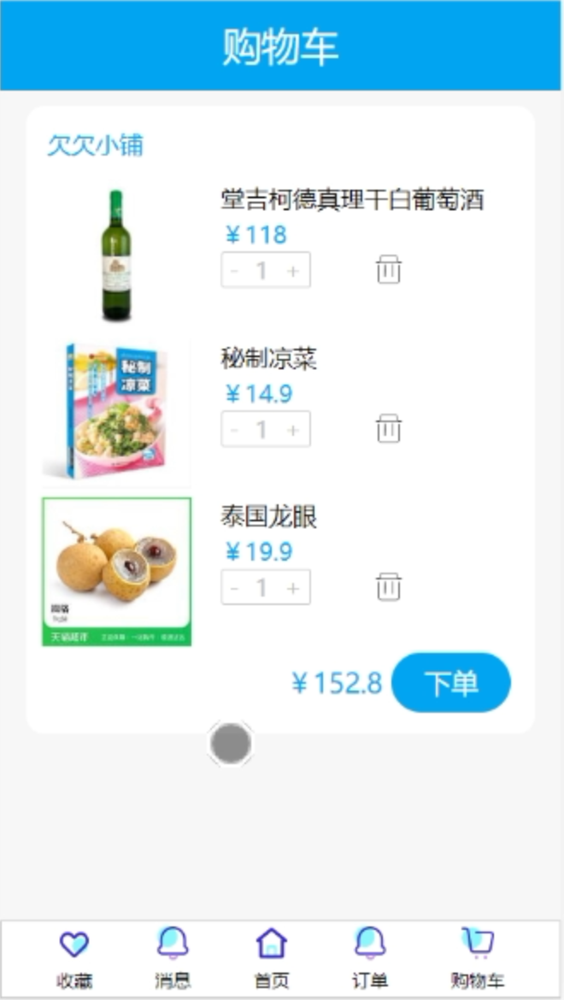
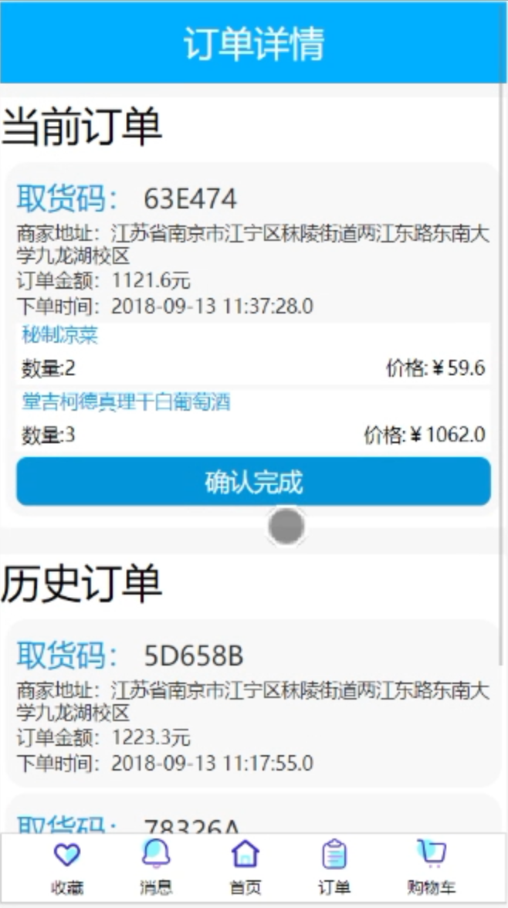
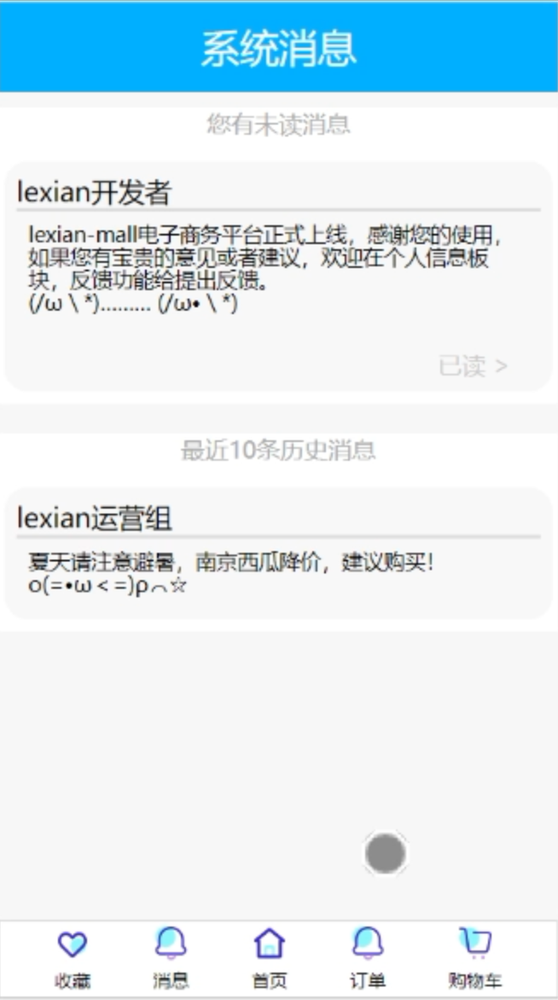

# 项目简介
> 本项目起始于2018年8月20日,服务于18-19-1学期实训，为lexian-mall的用户移动端前端部分

本项目已不再更新，本文中内容仅作为总结，详情请直接参照源代码

完整的项目前后端请参见地址 ~~[18lexian-mall](https://github.com/18Lexian-Mall)~~
被同组的另一个owner删除了？？？

## lexian-mall-user

### 开发
```shell
# 安装依赖
npm install
# 启动本地调试服务
npm run dev
# build
npm run build
```
**注意:** 本项目的zepto包含模块`zepto event ajax form ie deferred callbacks touch`,请参考官方文档构建所需要的zepto文件

**注意:** zepto不提供模块导入方式,本项目直接将`myzepto.js`作为入口文件之一打包,便于调用`$`的方法.

### 项目展示
<div>
  
  
  
  
  
  
  
  
</div>
### 项目目录

- dist:生成文件夹
- mock:测试用数据
- src:源代码
  - index.html:首页
  - common:通用部分
    - js:工具
      - myzepto.js:定制版zepto
      - cookie.js:自定义cookie操作函数
    - css:通用css
      - base.css:初始化css
      - init.css:css工具
  - component:自定义模块
    - Banner:轮播组件
    - Map:定位组件
    - TypeList:种类列表组件
  - pages:页面
    - bill:订单
    - cart:购物车
    - good:单个商品详情
    - goodsList:商品列表
    - like:收藏
    - msg:系统消息
    - person:个人信息
    - search:搜索结果
    - shop:商家详情
  - work
    - js:入口js,和页面一一对应
    - css:各页面主css,和页面一一对应,和页面一一对应
- .babelrc:babel配置
- package.json
- webpack.config.js


